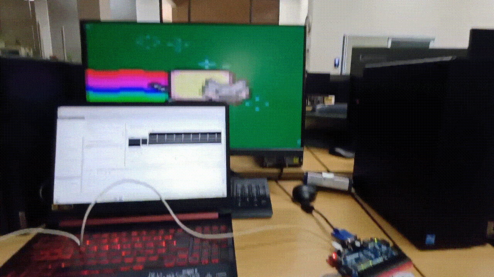

# HW Sync Lab Final Project: FPGA microSD Card GIF Displayer

 
   

This project demonstrates how to read a GIF stored on a microSD card using a Basys3 FPGA board, scale the resolution and display it via VGA output at a resolution of 640×480. You can switch between GIFs using a button on the board.

---

## How It Works

1. Convert and format the GIF frames into 16-bit color binary using Python.
2. Write the binary data directly to the microSD card using a sector-based write script.
3. Load the appropriate bitstream (e.g., `VGA`) onto the Basys3 FPGA.
4. Watch the GIF display and change frames using the button on the board.

---

## Bitstreams

* **SD**: Checks if the microSD card is functioning correctly. (All LEDs ON = OK)
* **SUM**: Verifies that all sectors containing the image frames are read correctly using checksum.
* **VGA**: The main bitstream used to display the stored GIF on the VGA output.

---

## Pictures

* The GIF consists of 6 frames.
* Each frame is 64×48 pixels, with each pixel stored as a 16-bit value.
* Frames are concatenated and saved into a binary file (`.bin`), totaling `6 × 64 × 48 × 2` bytes.
* A Python script converts each pixel to 16-bit color and writes the entire image data directly to specific sectors on the microSD card, bypassing the filesystem.

---
